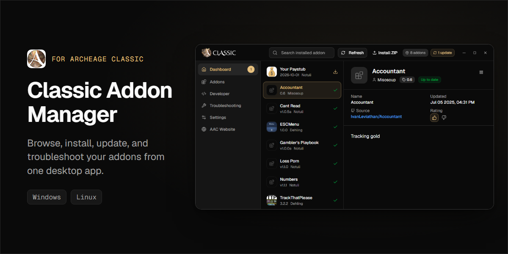
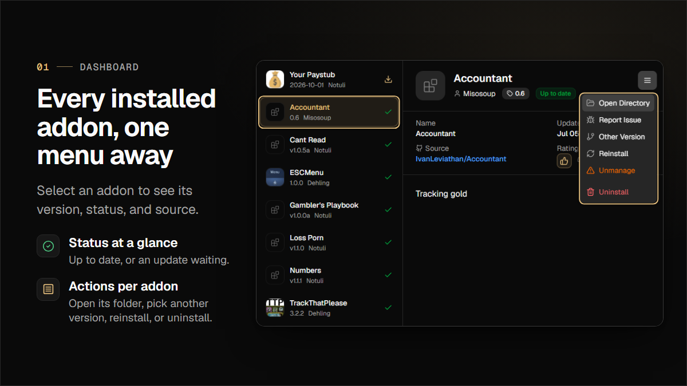
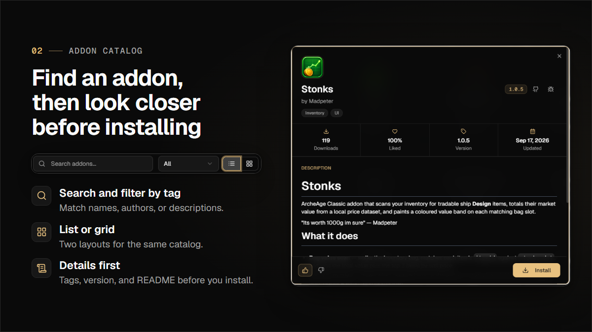
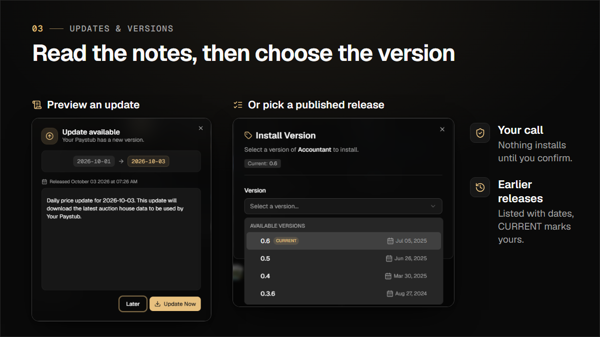
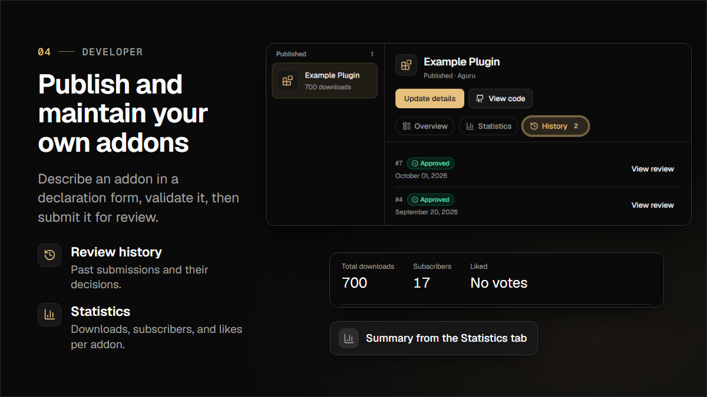
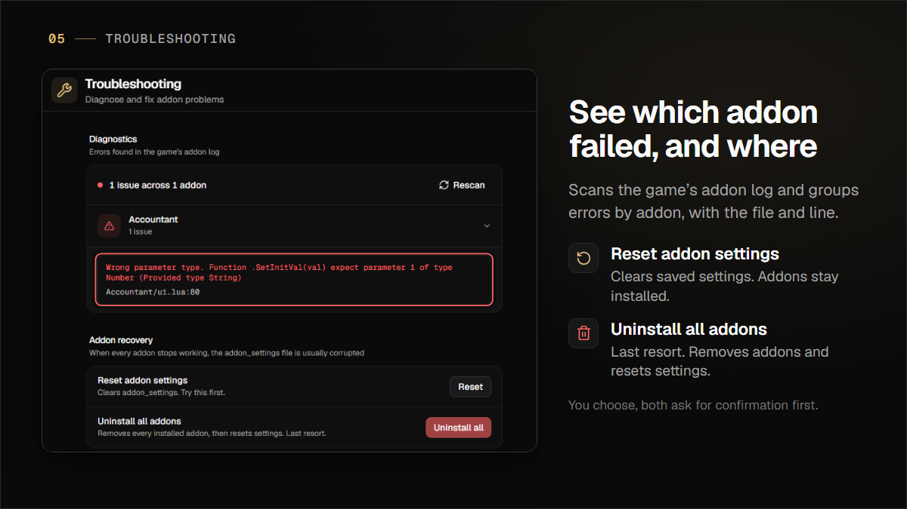
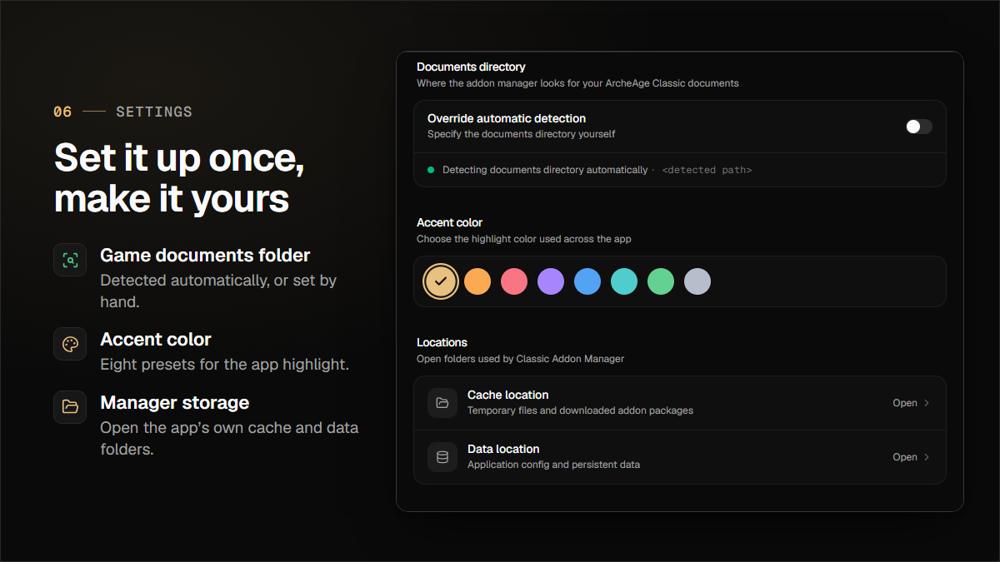

# Classic Addon Manager

A desktop application for managing addons in **ArcheAge**. Browse, install, update, and troubleshoot your addons all from one place.

[](https://ko-fi.com/gaijindev)

<p align="center">
  
</p>

---

## Feature Tour

### Manage installed addons

Select an addon to see its version, update status, and source, then open its folder, pick another version, reinstall, or uninstall from one menu.



### Discover new addons

Search the catalog, filter by tag, switch between list and grid, and read an addon's details before installing.



### Review updates and versions

Read release notes before updating, or choose a specific published release. Nothing installs until you confirm.



### Publish your own addons

Submit addons through a declaration form, follow each review decision, and track downloads, subscribers, and likes.



### Diagnose problems

Scan the game's addon log to see which addon raised an error and in which file and line. Recovery actions ask for confirmation.



### Personalize settings

Let the app detect your ArcheAge Classic documents folder, choose an accent color, and open the manager's cache and data folders.



---

## Download

You can get Classic Addon Manager in one of these ways:

- **ArcheAge launcher**: Click the **Addons** button in the launcher.
- **GitHub Releases**: Download `classic-addon-manager.exe` for Windows or the `.AppImage` for Linux from the [Releases page](https://github.com/classic-addon-manager/classic-addon-manager/releases).
- **In-app self-update**: The app notifies you when a new version is available. Windows executables and writable Linux AppImages can update themselves and restart automatically.

### Supported Platforms

- **Windows**: Full support (.exe installer)
- **Linux**: Supported as an AppImage, but designed primarily for Windows. Some features may not work

---

## Support

If you find this project useful, consider supporting development:

[](https://ko-fi.com/X8X219OKGE)

---

## Development

### Requirements

- Go 1.25+
- Node.js 22.12+
- PNPM

Install PNPM by following [pnpm.io/installation](https://pnpm.io/installation).

Then install the Wails CLI:

```
go install github.com/wailsapp/wails/v3/cmd/wails3@v3.0.0-beta.5
```

> We use Wails v3 beta (`v3.0.0-beta.5`). Make sure you install the matching CLI version. See [Wails v3 Installation](https://v3.wails.io/getting-started/installation) for details.

### Live Development

Run `wails3 dev` in the project directory. This starts a Vite development server with fast hot reload for frontend changes, plus the Wails window. Inspect the interface in the app window itself: development builds enable the WebView2 DevTools, so right-click → **Inspect** (or `F12` where the host page allows it) gives you the full app with working bindings.

Press **Ctrl+Alt+Q** while the app is focused to open or close **TanStack Query Devtools** and inspect cached queries and mutations. This shortcut is available only in frontend development mode.

The Vite URL (`http://localhost:9245`) is the frontend dev server only. It does not serve the Wails runtime: `/wails/runtime` and the other `/wails/*` endpoints are answered by the app's asset server, which is reachable inside the WebView (`http://wails.localhost:<vite-port>`) and not over a TCP port. Opening the Vite URL in a normal browser therefore has no Go bindings or events, and this app renders blank because it bootstraps from them. Use it only for isolated frontend work that does not touch the backend.

For a browser with working bindings and events, run the app in server mode:

```
wails3 task run:server
```

For live development in a browser instead, run `wails3 task dev:server` and open http://localhost:8080. This starts Vite for frontend hot module replacement and Air for Go rebuilds/restarts.

### Frontend Linting and Formatting

Run these commands from `frontend/` after `pnpm install`:

| Command             | Purpose                                 |
|---------------------|-----------------------------------------|
| `pnpm lint`         | Run oxlint and apply safe fixes         |
| `pnpm lint:check`   | Run oxlint without changing files       |
| `pnpm format`       | Format TypeScript/TSX with Prettier     |
| `pnpm format:check` | Check formatting without changing files |

Oxlint is configured in `frontend/.oxlintrc.json`. It uses native core, TypeScript,
React Hooks, Fast Refresh, and React Compiler rules.

Formatting is separate from linting and retains `frontend/.prettierrc`. Generated
Wails bindings and build output are excluded from both checks. Run `pnpm lint`
before `pnpm format`, overlapping type-import and import-sorting fixes can require
a second lint run.

### Building

To build a production package:

```
wails3 task build:prod
```

To build a Linux AppImage, run `wails3 task linux:create:appimage` on Linux. The task writes `bin/classic-addon-manager-<architecture>.AppImage`. AppImage generation downloads the linuxdeploy and AppRun tools as needed.

To build the server binary (no GUI window, serves the frontend and all bindings over HTTP):

```
wails3 task build:server
```

The binary is written to `build/bin/classic-addon-manager-server` (`.exe` on Windows). It defaults to http://localhost:8080; override with `WAILS_SERVER_HOST` / `WAILS_SERVER_PORT`. Pass `PRODUCTION=true` for a stripped production build (`-tags server,production`).

### Version Management

Use the `version` task instead of editing version numbers by hand. It keeps `build/config.yml`, the Windows resource, manifest and NSIS files, the Linux package config, and `backend/shared/types.go` in sync.

```
# Set an explicit version
wails3 task version SET=3.3.0

# Bump to the next version (defaults to patch)
wails3 task version BUMP=major
wails3 task version BUMP=minor
wails3 task version BUMP=patch
```

With no arguments, the task bumps the patch version. It changes only version fields and leaves other build settings alone.

- `BUMP` requires all version fields to match. If they differ or contain an invalid version, the task stops without writing any files.
- `SET` accepts `X.Y.Z` or `vX.Y.Z` and updates all version fields, even if their current values differ or are invalid.
- Run the task from the project root. You can also run the tool directly with `go run ./tools/setversion -set 3.3.0` or `go run ./tools/setversion -bump patch`.

### Project Structure

| Directory   | Description                                                 |
|-------------|-------------------------------------------------------------|
| `backend/`  | Go backend (addon logic, API client, services, auth)        |
| `frontend/` | React + TypeScript frontend (Vite, Tailwind CSS, shadcn/ui) |
| `build/`    | Build configuration, icons, installer scripts               |

### Tech Stack

- **Desktop framework:** Wails v3 (Go + WebView2)
- **Frontend:** React, TypeScript, Vite, Tailwind CSS v4, shadcn/ui
- **Fonts:** Geist + Geist Mono
- **State management:** Zustand + Jotai
- **Backend:** Go, Viper (config), Zap (logging)
- **Packaging:** NSIS (Windows), nfpm (Linux)
